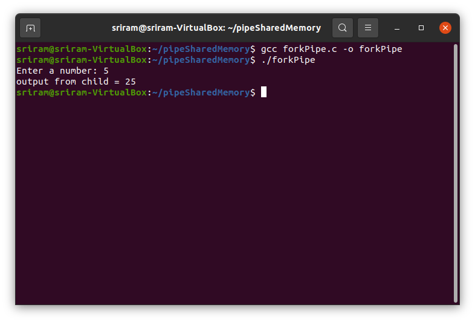
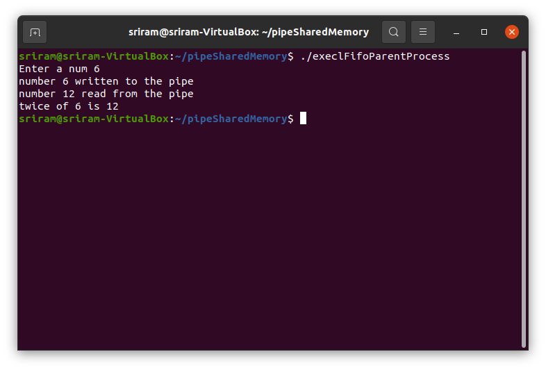
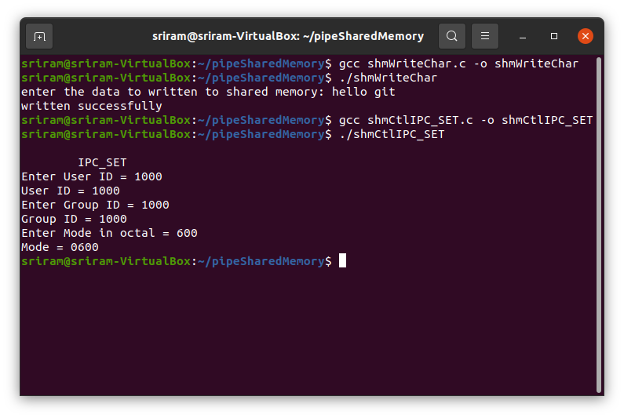
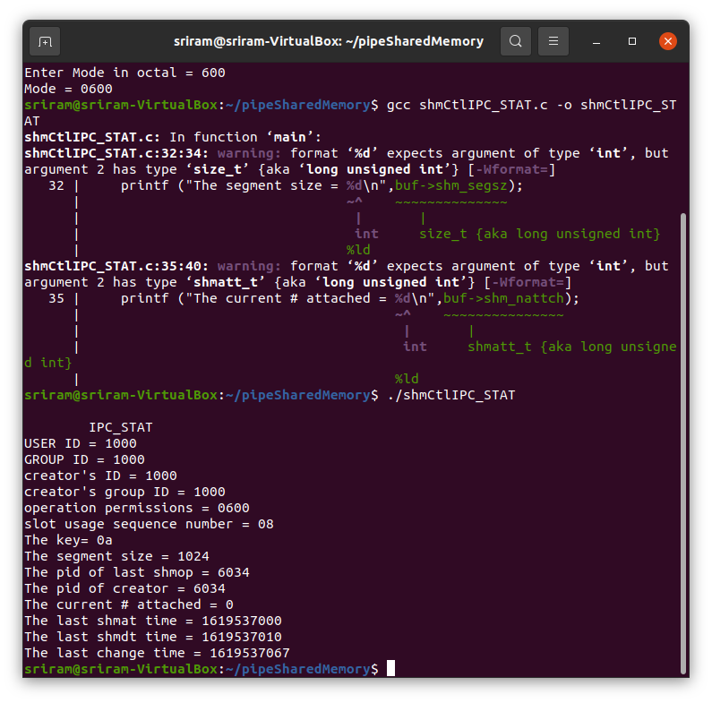

# Assignment – Pipe and Shared Memory

1. Write a program that uses fork and execl to create child process and uses pipe to pass data from one another.

Source code: [forkPipe.c](./forkPipe.c)

  

2. Program of child process called by execl in first program.

Source code: [execlFifoParentProcess.c](./execlFifoParentProcess.c),
[execlFifoChildProcess.c](./execlFifoChildProcess.c)

  

3. Write a program to read nature of fifo files using open(), close(), getpid()

Still in progress 

4. Write a program to illustrate IPC_SET

Source code: [shmCtlIPC_SET.c](./shmCtlIPC_SET.c)

Note: run the [shmWriteChar.c](./shmWriteChar.c) code first, for proper working

  

5. Write a program to illustrate IPC_STAT functionality using shmctl()

Source code: [shmCtlIPC_STAT.c](./shmCtlIPC_STAT.c)

Note: run the [shmWriteChar.c](./shmWriteChar.c) code first, for proper working

  

